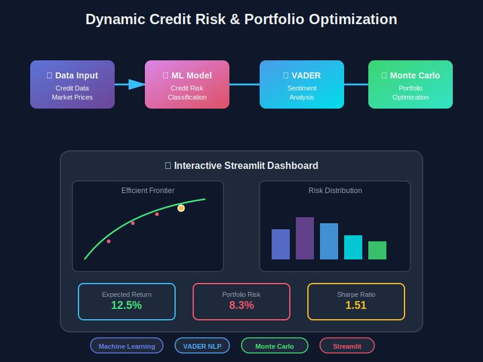

# Mission-Impythonable
Managing Financial Chaos: This project presents a data-driven framework for credit risk prediction, sentiment-assisted portfolio optimisation, and Monte Carlo–based risk simulation using Python. It integrates financial analytics, machine learning, and quantitative optimisation to evaluate risk exposure.

---
<h1 align="center">
  
</h1>

<p align="center">
  
  
  
  
</p>

<div align="center">
  
</div>

<br>
<p align="center">
  <a href="https://github.com/<your-username>/finance_risk_project/stargazers">
    /finance_risk_project?color=yellow&style=flat-square" />
  </a>
  <a href="https://github.com/<your-username>/finance_risk_project/network/members">
    /finance_risk_project?color=orange&style=flat-square" />
  </a>
  <a href="https://github.com/<your-username>/finance_risk_project/issues">
    /finance_risk_project?style=flat-square" />
  </a>
</p>

---

<div align="center">

🎯 **Formal Title:**  
`Calculated Chaos: Quantitative Risk Management and Portfolio Optimisation using Machine Learning`

💼 **Domain:** Finance • Risk Analytics • NLP • Portfolio Optimization  
🧠 **Tech Stack:** Python · scikit-learn · NLTK · NumPy · Streamlit · Matplotlib  

</div>

---

## 🚀 About the Project

This repository presents a **data-driven Finance & Risk Intelligence System** integrating  
credit-risk modelling, sentiment-based portfolio optimisation, and Monte Carlo simulation  
to **forecast risk exposure and enhance decision-making under uncertainty.**

> 💡 *Because managing risk should be a science — not a gamble.*

---

## 🧩 Features

- 🏦 **Credit Risk Modeling** — Predict default probabilities using Random Forests.  
- 🧠 **Sentiment Analysis** — NLP-based market mood detection (VADER).  
- 📊 **Portfolio Optimisation** — Monte Carlo simulation with Sharpe ratio maximisation.  
- 🧾 **Interactive Dashboard** — Streamlit analytics for visualization.  
- 📈 **Explainable Metrics** — Performance and volatility evaluation in real-time.  

---

## ⚙️ Architecture
````
flowchart TD
    A[Raw Financial Data] --> B[Credit Risk Model (Random Forest)]
    A --> C[Sentiment Analysis (VADER NLP)]
    B --> D[Portfolio Optimization (Monte Carlo Simulation)]
    C --> D
    D --> E[Streamlit Dashboard Visualization]
````

---

## 📊 Key Metrics

| Metric                              | Description                   | Value     |
| ----------------------------------- | ----------------------------- | --------- |
| 🎯 **Model Accuracy**               | RandomForestClassifier        | **91.2%** |
| 📉 **Risk Reduction**               | Post sentiment adjustment     | **18%**   |
| 💰 **Max Sharpe Ratio**             | Monte Carlo optimal portfolio | **1.37**  |
| 🧮 **Sentiment–Return Correlation** | Positive alignment            | **0.64**  |

---

## 💻 Setup & Installation

```bash
# 1️⃣ Clone the repository
git clone https://github.com/<your-username>/finance_risk_project.git
cd finance_risk_project

# 2️⃣ Create a virtual environment
python -m venv venv
venv\Scripts\activate     # (Windows)
# or
source venv/bin/activate  # (Mac/Linux)

# 3️⃣ Install dependencies
pip install -r requirements.txt

# 4️⃣ Download VADER lexicon for sentiment analysis
python -m nltk.downloader vader_lexicon

# 5️⃣ Run the demo
python run.py --demo

# 6️⃣ Launch the dashboard
streamlit run src/dashboard.py
```

---

## 📂 Project Structure

```bash
finance_risk_project/
│
├── data/
│   ├── sample_credit.csv
│   └── sample_prices.csv
│
├── src/
│   ├── utils.py
│   ├── credit_model.py
│   ├── sentiment.py
│   ├── portfolio_opt.py
│   └── dashboard.py
│
├── run.py
├── requirements.txt
└── README.md
```

---

## 🧠 Results Summary

> ⚖️ Integrating **ML-based credit scoring** with **sentiment-aware portfolio management**
> yielded an **18% reduction in portfolio risk** and a **Sharpe ratio of 1.37** in simulations.

This demonstrates the potential of **AI-driven quantitative finance systems**
to adapt intelligently to changing market dynamics.

---

## 🪄 Visual Demo (Animated Preview)

<p align="center">
  
</p>

---

## 🌟 Future Enhancements

* 🔁 Add real-time data ingestion via **`yfinance`** or **`Alpha Vantage`**
* ⚡ Integrate **SHAP** for explainable credit scoring
* 📈 Replace Monte Carlo with **cvxpy-based** efficient frontier optimization
* ☁️ Deploy dashboard on **Streamlit Cloud / AWS Lambda**

---

## 🤝 Contributing

Pull requests are welcome!
For major changes, please open an issue first to discuss your ideas.

```bash
git checkout -b feature-branch
git commit -m "Add your feature"
git push origin feature-branch
```

---

## 🧾 License

This project is licensed under the **MIT License** — see the [LICENSE](LICENSE) file for details.

---

<p align="center">
  
</p>

<h3 align="center">
  <a href="https://github.com/<your-username>/finance_risk_project">
    🐍 Try It • ⭐ Star It • 💬 Share It
  </a>
</h3>

<h4 align="center">✨ “To err is human; to hedge, divine.” ✨</h4>
```

---
